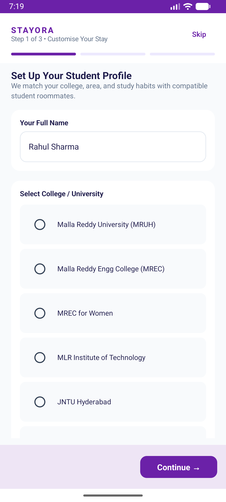
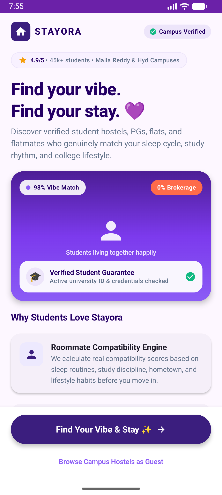
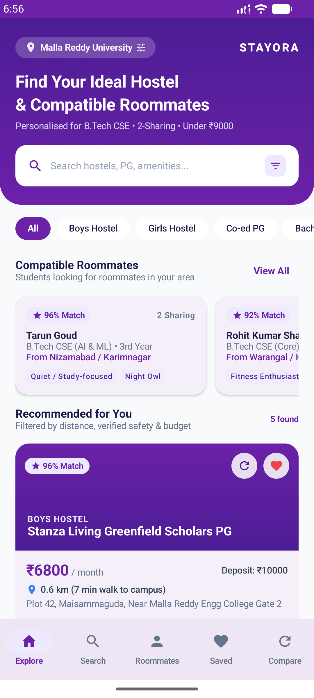
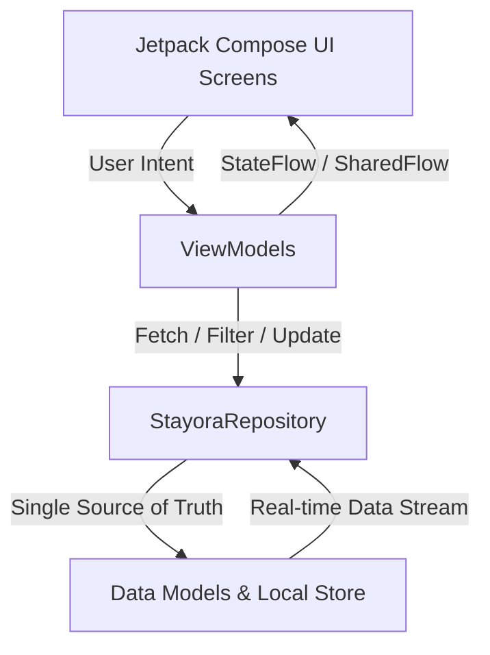

<div align="center">

# 🏆 Stayora — Smart Student Accommodation & Roommate Discovery

### 🥇 1st Place Winner — Malla Reddy University Hackathon 2024

[](https://github.com/pallapolvamshi-max/stayora)
[](https://developer.android.com/)
[](https://kotlinlang.org/)
[](https://developer.android.com/jetpack/compose)
[](https://developer.android.com/topic/architecture)
[](LICENSE)

<br/>

<p align="center">
  <b>Say goodbye to broker fees, roommate conflicts, and hidden PG curfews.</b><br/>
  Stayora is an intelligent mobile platform connecting university students with verified hostels, PGs, flats, and culturally & academically compatible roommates near their campus.
</p>

<p align="center">
  <a href="#-visual-showcase">📱 Visual Showcase</a> •
  <a href="#-the-problem--our-solution">💡 The Problem & Solution</a> •
  <a href="#-key-features">✨ Key Features</a> •
  <a href="#-architecture--tech-stack">🏗️ Tech Stack</a> •
  <a href="#-live-interactive-demo">🚀 Quick Start</a> •
  <a href="./Stayora_Pitch_Deck.pdf">📑 Pitch Deck</a>
</p>

---

</div>

## 📱 Visual Showcase

<div align="center">
  <table>
    <tr>
      <td align="center" width="33%">
        <b>🎯 Smart Onboarding & Match Form</b><br/><br/>
        
      </td>
      <td align="center" width="33%">
        <b>🏠 Personalized Home & Recommendations</b><br/><br/>
        
      </td>
      <td align="center" width="33%">
        <b>⚡ Live App & Interactive Experience</b><br/><br/>
        
      </td>
    </tr>
  </table>
</div>

---

## 💡 The Problem & Our Solution

### The Challenge
Every academic year, thousands of students relocating to major university clusters (such as **Malla Reddy University (MRUH)**, **Maisammaguda**, **Dulapally**, and **Kompally**) face significant hurdles:
- **Brokerage Exploitation**: Unregulated brokers charge exorbitant commissions for substandard rooms.
- **Roommate Incompatibility**: Random room assignments lead to clash of sleep schedules, study habits, food preferences, and conflict.
- **Lack of Transparency**: Hidden costs, undisclosed gate curfews (e.g. 9:00 PM vs 10:30 PM), unreliable Wi-Fi speeds, and unhygienic mess food.
- **Scattered Essentials**: Newcomers struggle to find nearby emergency medical facilities, metro feeds, TSRTC bus stops, and pharmacies.

### The Stayora Solution
**Stayora** eliminates the middlemen with a direct, verified ecosystem:
1. **AI-Powered Compatibility Scoring**: Mathematical match weighting based on college, branch, sleep schedule, study preferences, and lifestyle habits.
2. **Transparent Accommodation Profiles**: Direct view of per-bed rent, security deposit, curfew timings, mess menus, Wi-Fi speed (Mbps), and verified warden contacts.
3. **Side-by-Side Comparison Engine**: Compare up to 3 hostels simultaneously across 10 critical parameters.
4. **Local Life Directory**: Instant geolocation map for hospitals, public transit, supermarkets, and student food hubs.

---

## ✨ Key Features

| Feature | Description |
| :--- | :--- |
| **🎯 Smart Preference Onboarding** | Captures university, academic branch, budget range (₹3k–₹15k), preferred sharing (2/4-share), curfew flexibility, and lifestyle traits (night owl vs early bird, study focus). |
| **🔍 Multi-Parameter Search & Filter** | Real-time filtering across gender (Boys / Girls / Co-ed), distance to campus, budget, verified badge, vacant beds, rating, and required amenities. |
| **⚖️ Multi-Property Comparison Matrix** | Side-by-side comparison table analyzing monthly rent, security deposit, distance, curfews, Wi-Fi speed, meals, and security. |
| **💬 Direct Student-to-Warden Chat** | In-app simulated direct messaging with quick-inquiry chips (*"Is 2-sharing bed vacant?", "Can I schedule a visit?", "Food included?"*). |
| **👥 Compatible Roommate Spotlight** | Discover and connect with fellow students who share similar study schedules, cleanliness standards, and branch specializations. |
| **🏥 Campus Essentials & Transit Guide** | Dedicated directory covering TSRTC bus stops, Metro connectivity, 24/7 pharmacies, student mess hubs, and multispecialty clinics. |
| **❤️ Shortlist & Bookmarking** | Instant one-tap bookmarking to track favorite accommodations across sessions. |

---

## 🏗️ Architecture & Tech Stack

Stayora adheres to official Android architecture guidelines with a unidirectional data flow (UDF) pattern:



### Technology Highlights
- **Language**: Kotlin 1.9+
- **UI Framework**: Jetpack Compose with **Material Design 3**
- **Architecture**: MVVM (Model-View-ViewModel) + Repository Pattern
- **Async & Concurrency**: Kotlin Coroutines & `StateFlow` / `SharedFlow`
- **Navigation**: Jetpack Navigation Compose
- **Design Tokens**: Royal Purple (`#6B21A8`), Deep Violet (`#4C1D95`), Soft Lavender (`#EDE9FE`), and Emerald Verification (`#10B981`)
- **Live Simulator**: Lightweight high-fidelity Web Demo (HTML5/Canvas/CSS3) for instant presentations and jury evaluations

---

## 📂 Project Structure

```
stayora/
├── app/
│   ├── src/main/
│   │   ├── AndroidManifest.xml
│   │   └── java/com/stayora/app/
│   │       ├── MainActivity.kt               # Main entry point & theme setup
│   │       ├── StayoraApp.kt                 # Scaffold & bottom navigation host
│   │       ├── data/
│   │       │   ├── model/                    # Property, RoommateProfile, UserPreferences, FilterState
│   │       │   └── repository/               # StayoraRepository (Central data provider & search algorithms)
│   │       └── ui/
│   │           ├── theme/                    # Color, Type, Shape & Theme definition
│   │           ├── navigation/               # Navigation routes & backstack management
│   │           ├── components/               # PropertyCard, CompatibilityBadge, AmenityChip, StayoraBottomBar
│   │           └── screens/                  # Onboarding, Home, Search, Detail, Compare, Chat, Roommates, Facilities
├── preview/                                  # Instant web simulator for pitch presentations
│   ├── index.html
│   ├── styles.css
│   ├── app.js
│   └── start_preview.bat
├── Stayora_Pitch_Deck.pdf                    # Winning Hackathon Pitch Deck presentation
└── README.md
```

---

## 🚀 Quick Start & How to Run

### Option 1: Instant Interactive Demo (Zero Setup Required)
You can test the entire app interactively without waiting for an Android emulator:
1. Double-click `preview/start_preview.bat` (or run PowerShell):
   ```powershell
   powershell -ExecutionPolicy Bypass -File preview/start_server.ps1 -Port 8085
   ```
2. Open your browser and navigate to:
   ```
   http://localhost:8085/
   ```
3. Test all user journeys: Onboarding → Search & Filter → Property Detail → Compare Matrix → Roommate Match → Warden Chat.

### Option 2: Native Android Studio Build
1. Clone the repository:
   ```bash
   git clone https://github.com/pallapolvamshi-max/stayora.git
   ```
2. Open **Android Studio** (Hedgehog, Iguana, Jellyfish or later).
3. Select **Open** and choose the `stayora` project folder.
4. Let Gradle sync project dependencies.
5. Click **Run** (`Shift + F10`) targeting an Android Device or Emulator running **API 26+ (Android 8.0+)**.

---

## 📑 Pitch Deck & Presentation
The full hackathon presentation deck is included directly in this repository:
- 📄 **[Download Stayora Pitch Deck (PDF)](./Stayora_Pitch_Deck.pdf)**

---

## 🔮 Future Roadmap

- [ ] **AI Roommate Compatibility Voice Assistant**: Conversational agent assessing roommate vibe and lifestyle fit.
- [ ] **Instant Token Booking & Escrow**: Secure UPI-based token deposit system with refund protection.
- [ ] **Verified Student Identity**: Integration with DigiLocker / Student ID cards for 100% verified student badge.
- [ ] **Landlord & Warden Dashboard**: Web console for hostel managers to manage bed vacancies, mess updates, and gate passes in real-time.

---

## 👥 Contributors & Acknowledgements

- **Vamshi Pallapolu** ([@pallapolvamshi-max](https://github.com/pallapolvamshi-max))
- Built with ❤️ for the **Malla Reddy University Hackathon 2024**.
- Special thanks to the mentors, jury, and organizers for the insightful feedback and recognition!

---

<div align="center">
  <sub>⭐ If you find Stayora useful or inspiring, please consider starring this repository!</sub>
</div>
